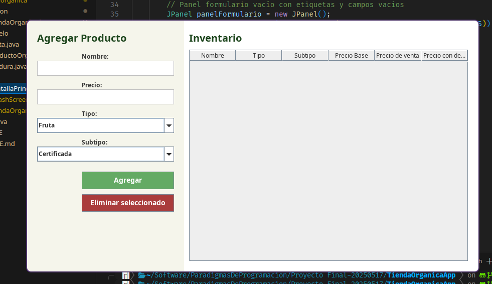

# 🥦 Tienda Orgánica - Sistema de Inventario en Java

Este proyecto es una aplicación de escritorio desarrollada en Java que permite gestionar productos orgánicos como frutas y verduras. Cuenta con una interfaz gráfica amigable, permite agregar, visualizar y eliminar productos, y calcula automáticamente descuentos y precios finales.

## 📂 Estructura del Proyecto

```text
src/
├── App.java                 # Clase principal que inicia la aplicación y muestra la interfaz gráfica
└── tiendaorganica
    ├── gestion             # Paquete encargado de la lógica de gestión del inventario
    │   └── TiendaOrganica.java  # Clase que maneja la lista de productos: agregar, eliminar, obtener inventario
    ├── modelo              # Paquete con las clases que representan los productos y sus propiedades
    │   ├── ProductoOrganico.java  # Clase abstracta base para productos orgánicos (frutas y verduras)
    │   ├── Fruta.java            # Clase que modela una fruta con su subtipo y cálculos de precio
    │   └── Verdura.java          # Clase que modela una verdura con su subtipo y cálculos de precio
    └── ui                  # Paquete con las clases relacionadas a la interfaz gráfica (Swing)
        ├── SplashScreen.java        # Pantalla de bienvenida que muestra el logo al iniciar
        ├── PantallaPrincipal.java   # Ventana principal con formulario y tabla para gestionar productos
        └── TiendaOrganicaGUI.java   # Controla la secuencia de mostrar splash y luego ventana principal
```

## 📦 Descripción de Archivos

### `App.java`

Archivo principal que lanza la aplicación. Su único propósito es iniciar la GUI llamando a `TiendaOrganicaGUI`.

---

### 📁 `tiendaorganica/gestion/`

#### `TiendaOrganica.java`

Clase encargada de gestionar la lista de productos (`Fruta` y `Verdura`). Provee métodos para:

* Agregar productos al inventario (directamente o usando métodos específicos como `agregarFruta()` y `agregarVerdura()`)
* Eliminar productos por nombre
* Obtener la lista completa del inventario

Valida que los productos no sean nulos y que los nombres no estén vacíos. Utiliza una lista interna para almacenar los productos agregados.

---

### 📁 `tiendaorganica/modelo/`

#### `ProductoOrganico.java`

Clase abstracta base para todos los productos orgánicos. Define atributos y métodos comunes como:

* `nombre`: nombre del producto (ej. "Manzana")
* `tipo`: categoría general (ej. "Fruta", "Verdura")
* `precio`: precio base del producto

Incluye validaciones para evitar precios negativos, y getters/setters para modificar los valores. El método `toString()` devuelve una representación legible con todos los atributos básicos.

#### `Fruta.java`

Subclase de `ProductoOrganico` que representa frutas. Añade:

* `tipoFruta`: subtipo específico de la fruta (por ejemplo: "certificada", "local", "de temporada")
* Método `calcularPrecioVenta()`: ajusta el precio base según el tipo de fruta
* Método `aplicarDescuento()`: aplica un 15% de descuento si el precio es mayor a \$3.00
* Método `toString()`: muestra información completa del producto, incluyendo precio con descuento y precio final

#### `Verdura.java`

Subclase de `ProductoOrganico` que representa verduras. Añade:

* `tipoVerdura`: subtipo específico como "orgánica", "local" o "fuera de temporada"
* Método `calcularPrecioVenta()`: ajusta el precio con recargos según el tipo de verdura
* Método `aplicarDescuento()`: aplica un 10% de descuento si el precio es mayor a \$5.00
* Método `toString()`: muestra los detalles relevantes como nombre, tipo, precio base y precio con descuento

---

### 📁 `tiendaorganica/ui/`

#### `SplashScreen.java`

Pantalla de bienvenida simple que muestra un logo antes de cargar la interfaz principal. Realiza lo siguiente:

* Carga una imagen (`logo.png`) desde el classpath y la escala adecuadamente
* Muestra el nombre de la tienda con estilo personalizado
* Utiliza un diseño vertical centrado para mostrar el logo y el título

#### `PantallaPrincipal.java`

La ventana principal de la aplicación. Permite:

* Agregar productos al inventario especificando nombre, precio, tipo y subtipo
* Visualizar los productos agregados en una tabla, con sus precios base, precios ajustados y precios con descuento
* Eliminar productos seleccionados de la tabla
* Manejar dinámicamente la selección de subtipos según el tipo (Fruta o Verdura)
* Usa el modelo `TiendaOrganica` para almacenar los productos y los métodos `calcularPrecioVenta()` y `aplicarDescuento()` para mostrar los datos correctos

#### `TiendaOrganicaGUI.java`

Clase que organiza la ejecución de la interfaz gráfica. Realiza las siguientes acciones:

* Habilita el suavizado de fuentes para mejor visualización
* Muestra primero un `SplashScreen` durante 3 segundos
* Luego lanza la `PantallaPrincipal` para gestionar el inventario

---

## 🛠️ Tecnologías Utilizadas

* Java SE 17+
* Swing (interfaz gráfica)
* Organización por paquetes (`modelo`, `gestion`, `ui`)
* Buenas prácticas de POO (herencia, polimorfismo)

---

## 📸 Captura de pantalla




---

## 👨‍🏫 Autores 👩‍🏫🧑‍🏫👨‍💼

- Kevin Mauricio Rosales Cerna — RC25025  
- Daniel Enrique Menendez Gomez — MG13020  
- Francisco Alberto García Hernandez — Gh25004  
- Yanci Carolina Avelar Alvarenga — AY22004

---


## 📄 Licencia

Este proyecto está bajo la licencia MIT. Consulta el archivo [LICENSE](LICENSE) para más detalles.
